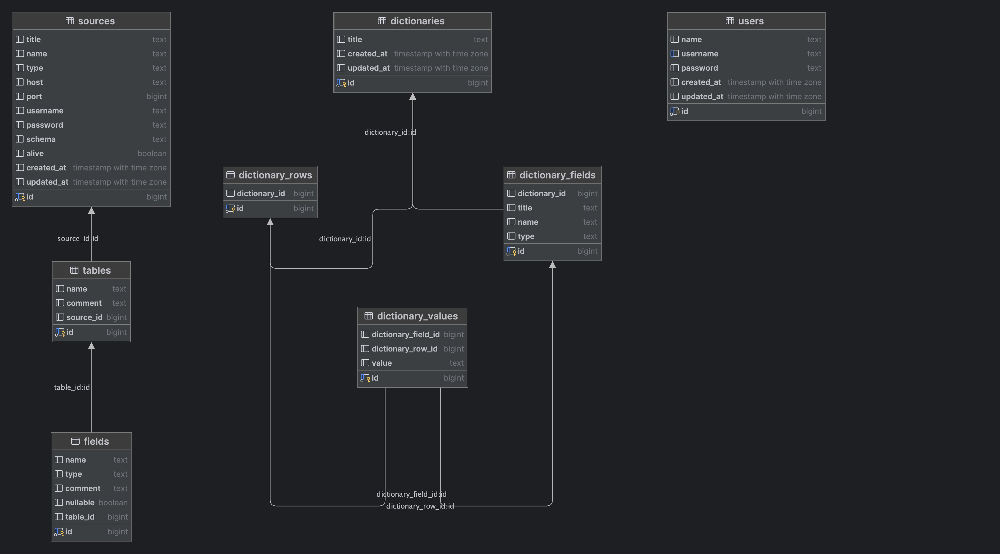

# DMAAS - Data Management And Analytic System

> Система подключения разных источников данных, кросс-субд запросов и умных отчетов по собранным датасетам

[](https://github.com/Mubiridziri/dmaas/actions/workflows/go.yml)
____

## Какие функции поддерживает проект? (или будет поддерживать в перспективе)

- ✅ Подключение данных из разных источников
- ✅ [WIP] Создание общих датасетов с данными из одних или разных СУБД (без программирования и SQL)
- ✅ [WIP] Автоматические слепки данных по датасетам в указанные интервалы времены
- ✅ [WIP] Отслеживание показателей на основе слепков (тенденции)
- ✅ [WIP] Прогнозирование показателей при сохранении тенденции изменения значений
- ✅ [WIP] Автоматические математические операции "налету" (в датасетах)
- ✅ [WIP] Создание собственных справочников для использования в датасетах (прим. расшифровка значений из удаленной БД)
- ✅ [WIP] Построение графиков на основе датасетов
- ✅ [WIP] Создание пользовательских статистических экранов (дашбордов) с использованием различных форм представления
  данных

## Технологии

### Подключение внешних источников

Подключение внешних источников происходит посредством технологии PostgreSQL Foreign Data Wrapper. Данная технология
позволяет знакомить базу данных приложения (PostgreSQL) с другими СУБД через Data Wrapper, а также оперрировать
данными в другой БД не дублируя их в базе данных приложения. То есть, мы храним описания структур данных другой базы
данных, а
сами данные запрашивает только в момент потребности.

### Датасеты и кеширование

Для создания датасетов и их кеширования (для доступа данным даже тогда, когда удаленная БД стала недоступна по каким
либо причинам)
мы используем PostgreSQL Materialized View. Данный вид View отличается от стандартных тем, что хранит в себе последний
запрашиваемый слепок данных.

### Бекенд

Бекенд приложения написан на языке Go с использованием таких основных пакетов как:

- [gin-gonic](https://github.com/gin-gonic/gin)
- [GORM](https://gorm.io/)
- [Swag](https://github.com/swaggo/swag)

Прочие зависимости можно посмотреть в `go.mod`

### Прочие технологии

- Docker & Docker-Compose
- Makefile
- PostgreSQL
- GitHub Actions

### База данных

В основе приложения используется PostgreSQL и это не может быть изменено. Данное утверждения не является ошибкой
архитектуры, так как приложение, по сути своей, является интерфейсом для некоторых встроенный в PostgreSQL функций (
FDW).

Структура базы данных, на момент последнего обновления этого документа, является такой:



### Структура проекта

```text
📂cmd/
├─ 📂dmass
│  ├─ 📄main.go     // main пакет приложения, который имеет минимум логики, только запускает приложение
📂internal/
├─ 📂app/           // Основной пакет приложения. Здесь инициализируются зависимости, запускаются основные горутины, запускается веб-сервер
├─ 📂database/      // Конфигурация базы данных и миграции
├─ 📂config/        // Конфигурация приложения
├─ 📂server/        // Конфигурация сервера (роутера), описание API-entrypoint'ов
├─ 📂entity/        // Сущности и репозитории
├─ 📂usecase        // Слой бизнес логики
│  ├─ 📂 user       // Пользователи
│  ├─ 📂 sources    // Удаленные источники данных (Foreign Servers)
│  ├─ 📂 tables     // Получение стурктуры удаленных источников данных
│  ├─ 📂 tabledata  // Получение данных удаленных источников данных
│  ├─ 📂 dictionary // Пользовательские справочники
├─ 📂utils          // Служебные методы используемые на всех слоях приложения

```

## Как запустить проект?

### Для запуска в dev-окружении при условии, что у Вас установлен Go

```bash
$ make dev
```

### Для запуска в Docker-Compose

```bash
$ make docker-up
```

## Полезные команды

```bash
$ make help
build                          Build a version
clean                          Remove temporary files
dev                            Go Run
swag                           Update swagger.json
swag-fmt                       Formatter for GoDoc (Swagger)
docker-up                      Start Docker-Compose Container with app & database
docker-down                    Down Docker-Compose Containers
docker-database-up             Start Docker-compose Container with only database service
```

## Планы после MVP

1. Расширенная поддержка разных СУБД (MySQL, Oracle, MSSQL в приоритете)
2. Поддержка импорта загрузки данных со сторонних API (JSON) и применения их в датасетах
3. Поддержка развертывания и масштабирования в Kubernetes
4. Поддержка загрузки и импорта данных из файлов (по URL, ручной загрузке) и применения их в датасетах
5. Поддержка загрузки, обработки и импорта Геоданных (GeoJSON) и применения их в датасетах
6. Поддержка определения изменений и уведомление об изменениях внешних источников 